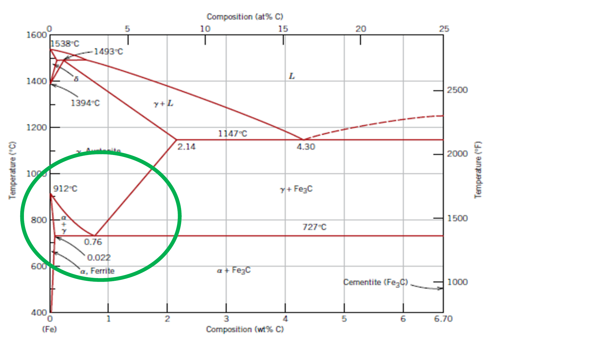

# Master Formula and Exam Methods

Source: `STM/Material(1), STM/Material(2), Exam simulation_STM eng.pdf`

Purpose: open-note exam guide. It prioritizes answer structure, formulas, tutorial methods, and professor-style traps.

## Exam Pattern To Prepare For

- The exam simulation is 45 minutes with 9 questions. It mixes open theory, multiple choice, and calculations.
- High-probability calculation families: tensile/elastic design, thermal expansion or thermal stress, generic phase diagrams, and Fe-C diagram calculations.
- High-probability theory families: heat conduction, sintering, ceramic porosity, glass/safety glass, thermoplastic vs thermoset polymers, mechanical test interpretation, and material-class comparisons.
- In multiple choice, the professor often asks for the only correct item. Eliminate options that use absolute wording such as "no effect", "always", or "only" when the lecture taught a conditional mechanism.

## Mechanical Formula Block

- Stress: sigma = F / A. Use N/mm2 = MPa when force is in N and area is in mm2.
- Engineering strain: e = (l - l0) / l0 = Delta l / l0. It is dimensionless; multiply by 100 for percent.
- Hooke law in the elastic field: sigma = E e. Therefore e = sigma / E and Delta l = (sigma / E) l0.
- Circular section: A = pi r2 = pi d2 / 4.
- Safety factor for no plastic deformation: sigma_allowed = YS / n, then Fmax = sigma_allowed A.
- Poisson effect: nu = - transverse strain / longitudinal strain. If a diameter decreases, transverse strain is negative and tensile longitudinal strain is positive.
- Seemly/engineering fracture stress uses the initial area. True fracture stress uses the final reduced area at rupture.
- Ductility or elongation at fracture: A% = 100 (lf - l0) / l0.
- Necking/reduction of area: Z% = 100 (A0 - Af) / A0. For a circular section, area scales with d2.
- Toughness: area under the stress-strain curve up to fracture. Resilience modulus in the elastic field: Ur = 1/2 sigma_y e_y = sigma_y2 / (2E).
- Fracture toughness: KIc = Y sigma_c sqrt(pi a). Failure occurs when K reaches KIc. Larger cracks, higher stress, and unfavorable geometry increase risk.
- Crack-tip stress concentration for an elliptical crack: sigma_m = 2 sigma_0 sqrt(a / r_t). Sharper cracks have smaller r_t and higher local stress.
- Hardness examples: Brinell HB = F / (pi D d). Vickers HV = 1.854 F / L2. For steels, a rough correlation is TS about 3.45 HB.

## Creep and Fatigue Block

- Creep test: constant load at constant high temperature; record strain versus time.
- Creep becomes important for metals above about 0.3-0.4 Tm, ceramics above about 0.6-0.7 Tm, and amorphous materials above Tg.
- Creep stages: primary has decreasing strain rate; secondary has approximately constant strain rate; tertiary accelerates because voids and cracks form until rupture.
- Higher stress and higher temperature shift creep curves upward and reduce life.
- Creep resistance improves with high Tm/high E materials, large grains or single crystals, solid-solution strengthening, precipitates, and second phases.
- Fatigue is failure under cyclic loading, often below YS or UTS. Use an S-N/Wohler curve to read fatigue life or fatigue strength.
- Stress amplitude: sigma_a = (sigma_max - sigma_min) / 2.
- Ferrous alloys can show a fatigue limit; many non-ferrous alloys such as Al and Cu do not show a true intrinsic limit in the same way.

## Thermal Formula Block

- Heat capacity: C = dQ / dT or DeltaE / DeltaT, units J/K.
- Specific heat: c = dQ / (m dT), units J/(kg K).
- One-dimensional conduction: Q_energy = k A t DeltaT / Delta x. Heat flux q = k DeltaT / Delta x. 1 W = 1 J/s.
- Thermal conductivity ranking: k_metals > k_ceramics >> k_polymers. Glasses are lower than crystalline ceramics because phonons propagate poorly without a crystalline lattice. Porosity lowers k because air is a poor conductor.
- Diamond has very high k because it has strong bonds, high E, low defects, similar atomic masses, and a simple crystalline cell.
- Free thermal expansion: DeltaL = alpha DeltaT L0 and thermal strain e_th = alpha DeltaT.
- Constrained thermal stress: sigma = E alpha DeltaT in magnitude. Heating a constrained rod produces compression; cooling produces tension.
- Typical CTE order: alpha_ceramics < alpha_metals << alpha_polymers. Stronger bonds give lower alpha, higher E, and higher melting temperature.
- Thermal shock resistance first approximation: TSR about sigma_f k / (E alpha). Best resistance needs high strength, high k, low E, and low alpha; in practice, the main design target is high k and low alpha.

## Phase Diagram Method

- Component: element or compound needed to define the system. Binary system: two components.
- Phase: homogeneous portion with uniform chemical and physical characteristics.
- Phase diagram axes for binary condensed systems: temperature on y-axis, composition wt.% on x-axis.
- Gibbs rule: V = C - f + n. For binary condensed diagrams at constant pressure, V = C - f + 1 = 3 - f.
- Horizontal rule/tie line: in a two-phase field, draw a horizontal line at the temperature. Intersections with the phase boundaries give the compositions of the phases.
- Lever rule: the fraction of a phase is proportional to the opposite segment of the tie line. For phases at C1 and C2 and alloy composition C: fraction phase at C1 = (C2 - C) / (C2 - C1); fraction phase at C2 = (C - C1) / (C2 - C1).
- Always state: phases present, phase compositions, relative amounts, and microstructure if requested.
- Eutectic reaction: liquid transforms into two solid phases, L <-> alpha + beta. Peritectic reaction: liquid plus one solid transforms into another solid, L + delta <-> gamma in the Fe-C context.

## Fe-C Diagram Recipes

Key Fe-Fe3C landmarks used in the tutorials:
- Eutectoid composition: about 0.76 wt.% C.
- Eutectoid temperature: about 727 C.
- Maximum C solubility in ferrite at eutectoid: about 0.022 wt.% C.
- Cementite composition: 6.70 wt.% C.
- Eutectic composition: about 4.30 wt.% C at 1147 C.
- Maximum C in austenite at eutectic temperature: about 2.14 wt.% C.

Hypo-eutectoid steel, C0 < 0.76:
- Just above 727 C: alpha ferrite + gamma austenite.
- Pro-eutectoid ferrite fraction = (0.76 - C0) / (0.76 - 0.022).
- Austenite fraction just before eutectoid = (C0 - 0.022) / (0.76 - 0.022).
- At room temperature, that austenite becomes pearlite, so pearlite fraction equals the austenite fraction just before the eutectoid transformation.
- Example from Exercise 8: for 0.20% C, pro-eutectoid ferrite = (0.76 - 0.20)/(0.76 - 0.022) = 76%; pearlite = (0.20 - 0.022)/(0.76 - 0.022) = 24%.

Hyper-eutectoid steel, 0.76 < C0 < 2.14:
- Just above 727 C: gamma austenite + Fe3C cementite.
- Pro-eutectoid cementite fraction = (C0 - 0.76) / (6.70 - 0.76).
- Austenite fraction just before eutectoid = (6.70 - C0) / (6.70 - 0.76).
- At room temperature, that austenite becomes pearlite.
- Example from Exercise 8: for 1.20% C, pearlite = (6.70 - 1.20)/(6.70 - 0.76) = 92.5%; pro-eutectoid cementite = (1.20 - 0.76)/(6.70 - 0.76) = 7.4%.

Peritectic practice from Exercise 9:
- For low-carbon compositions near the peritectic, read phase compositions with a horizontal tie line and then apply the lever rule exactly as in generic diagrams.
- Example for 0.34% C at one two-phase point: if delta ferrite is 0.05% C and liquid is 0.40% C, delta fraction = (0.40 - 0.34)/(0.40 - 0.05) = 17%, liquid = 83%.
- Example for 0.13% C at the same tie line: delta fraction = (0.40 - 0.13)/(0.40 - 0.05) = 77%, liquid = 23%.

## Open Answer Templates

Heat conduction in solids:
Define k and units. Explain phonons and free electrons. Say electrons dominate in metals, phonons dominate in ceramics, amorphous materials and polymers conduct poorly, porosity lowers k, and diamond is high-k because of strong bonds, low defects, similar atomic mass, and simple crystal structure.

Sintering:
Define it as densification of compacted powders during firing below the melting point of the main material. Explain diffusion, neck formation between particles, pore reduction, shrinkage, higher strength, and why it is central for ceramics that are not produced by melting.

Safety glass:
Start from brittle glass and defects. Then explain the design loads, tempered glass surface compression/core tension, chemical tempering by ion exchange, laminated/multilayered glass with polymer sheet retaining fragments, armoured glass with metallic network for fire/flame delay, and foamed glass for insulation rather than impact resistance.

Thermoplastic vs thermoset:
Thermoplastics soften on heating and can be reshaped/recycled; chains are linear or branched with secondary bonding. Thermosets cure into a cross-linked network with covalent cross-links, are permanently set, more rigid/brittle/dimensionally stable, and cannot be remelted. Elastomers have few bridges and very high elastic deformation.
